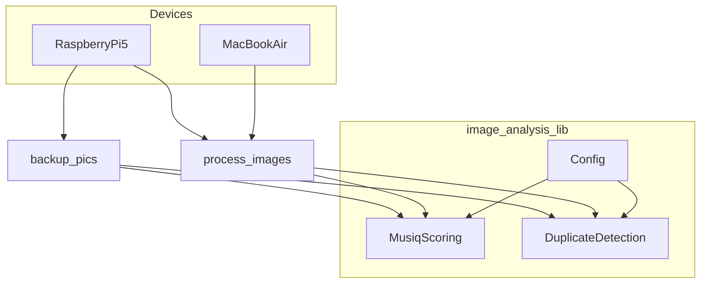

/Users/douglasgarrett/.cursor/plans/shared-image-analysis-library_0ec8bc79.plan.md
---
name: shared-image-analysis-library
overview: Design a shared image-analysis library repo that provides MUSIQ scoring and duplicate-photo detection to both the `backup_pics` and `process_images` projects across Raspberry Pi and Mac environments.
todos:
  - id: discover-current-logic
    content: Discover and document current MUSIQ scoring and duplicate-detection code in backup_pics and process_images
    status: completed
  - id: define-shared-api
    content: Design the shared MUSIQ and duplicate-detection APIs and configuration strategy
    status: completed
  - id: create-shared-repo
    content: Set up the new image_analysis_lib repo with packaging and structure
    status: completed
  - id: extract-musiq
    content: Extract and refactor MUSIQ scoring logic into the new library
    status: completed
  - id: extract-duplicates
    content: Extract and refactor duplicate-detection logic into the new library
    status: completed
  - id: add-cli
    content: Implement optional CLI commands for scoring and deduplication
    status: completed
  - id: integrate-backup-pics
    content: Update backup_pics to use the shared library
    status: completed
  - id: integrate-process-images
    content: Update process_images to use the shared library and surface controls in the GUI
    status: completed
  - id: document-and-tune
    content: Document usage and tune performance/thresholds for Raspberry Pi and MacBook Air
    status: completed
isProject: false
---

## Goals

- **Create a shared library repo** that encapsulates MUSIQ image-quality scoring and duplicate-photo detection logic.
- **Integrate the library** with both `backup_pics` (headless/automation focus, often on Raspberry Pi 5) and `process_images` (GUI and review, on Pi or MacBook Air).
- **Support flexible execution locations and thresholds**, so scoring/deduping can run on Pi, Mac, or both, and can be re-run with different parameters.

## High-level architecture

- **New repo**: `image_analysis_lib` (name TBD) containing:
  - `musiq_scoring` module: load MUSIQ model, score single images and batches, configurable thresholds, CPU/GPU-agnostic where possible.
  - `duplicate_detection` module: compute perceptual hashes / embeddings and compare for near-duplicates, configurable similarity thresholds.
  - `config` module: central definitions for thresholds, batch sizes, model paths, and device selection.
  - Optional **simple CLI** (e.g. `image-analysis-cli`) for running scoring and deduping over a directory from the command line.
- **Dependency model**:
  - Both `backup_pics` and `process_images` declare this repo as a dependency using either a **git submodule** or a **VCS pip dependency** (e.g. `git+ssh://...#egg=image_analysis_lib`).
  - Both projects import the same public APIs, so logic and thresholds stay in sync.

### Conceptual flow

## Detailed steps

- **1. Discover and isolate current logic**
  - In `backup_pics`, locate existing MUSIQ scoring code and duplicate-photo detection logic (including any model-loading, feature extraction, and thresholding code).
  - In `process_images`, locate any overlapping or partially implemented MUSIQ/duplicate logic and note differences (API shape, assumptions, performance tweaks).
  - Identify **input/output contracts** currently used (e.g. image path in, numeric score out; list of image paths in, clusters or pairs out) and any metadata stored (e.g. scores in a DB, JSON sidecar files).
- **2. Define shared APIs**
  - Design a **minimal, stable interface** in the new library, for example:
    - `score_image(path: str) -> float` and `score_images(paths: list[str]) -> dict[str, float]`.
    - `find_duplicates(paths: list[str]) -> list[tuple[str, str, float]]` or a clustered representation.
  - Decide on **configuration strategy**:
    - Global config object or Pydantic-style settings (e.g. from env vars or a config file) specifying thresholds (quality cutoff, duplicate similarity), batch sizes, device preference.
  - Ensure APIs are **agnostic to caller environment**, so they work identically on Pi and Mac given the same config.
- **3. Design the new repo layout and packaging**
  - Create a simple Python package structure, for example:
    - `image_analysis_lib/__init__.py`
    - `image_analysis_lib/musiq.py`
    - `image_analysis_lib/duplicates.py`
    - `image_analysis_lib/config.py`
    - `pyproject.toml` or `setup.cfg` + `setup.py` defining dependencies and entry points.
  - Factor out **device-specific concerns**:
    - Keep model-download or heavy dependencies clearly defined so Pi vs Mac can configure them (e.g. different wheels or optional extras).
    - Allow for CPU-only operation on Pi 5 with smaller batch sizes.
- **4. Extract and refactor MUSIQ scoring**
  - Move the MUSIQ model-loading and scoring code from `backup_pics` into `image_analysis_lib/musiq.py`.
  - Normalize:
    - Input type (path vs pre-loaded array).
    - Output scale and interpretation (e.g. 0–100 or 0–1, higher is better).
  - Add **configuration hooks** for:
    - Quality thresholds (for filtering vs tagging).
    - Batch size and device (CPU/GPU, if relevant).
  - Expose a **clean, documented interface** used by both projects.
- **5. Extract and refactor duplicate detection**
  - Move perceptual hashing / embedding / nearest-neighbor logic into `image_analysis_lib/duplicates.py`.
  - Support:
    - Running over a directory or explicit list of paths.
    - Configurable similarity thresholds and distance metrics.
  - Provide options for **incremental runs** (e.g. caching hashes) so re-runs with new thresholds are efficient.
- **6. Add a small CLI layer (optional but useful)**
  - Implement console scripts, e.g.:
    - `image-analysis score --input /path/to/images --output scores.json`.
    - `image-analysis dedupe --input /path/to/images --output duplicates.json`.
  - This enables **re-scoring or re-deduping on MacBook Air** without changing `backup_pics` logic—just point the CLI at the same image root and possibly reuse a cache.
- **7. Integrate with `backup_pics`**
  - Replace in-project MUSIQ and duplicate detection code with imports from `image_analysis_lib`.
  - Ensure `backup_pics` parameters (thresholds, directories, DB interactions) are wired through to the library via config or function arguments.
  - Verify that existing workflows on **Raspberry Pi 5** still function and that performance is acceptable (tune batch sizes, caching, etc.).
- **8. Integrate with `process_images`**
  - Update `process_images` to call the shared library for:
    - Displaying or using MUSIQ scores in the GUI.
    - Showing duplicate clusters or suggestions.
  - Wire GUI controls to the library's thresholds so users can tweak and re-run scoring or deduping—either through the CLI or via direct function calls.
- **9. Plan for distribution and updates**
  - Choose concrete integration mode:
    - Start with adding `image_analysis_lib` as a **git submodule** to both projects for local development.
    - Optionally later publish as a **private or public pip package** (e.g. GitHub + `pip install git+...`).
  - Document in each project how to:
    - Update the submodule / dependency.
    - Migrate thresholds or config when the shared library changes.

## Considerations for Pi vs Mac

- Keep **heavy dependencies** (e.g. specific ML frameworks) optional or clearly version-pinned to support both Raspberry Pi 5 and MacBook Air.
- Provide config options for **resource-constrained devices** (Pi): smaller batches, CPU-only, possible quantized models.
- Ensure that any on-disk caches (scores, hashes) have a **stable schema**, so runs on Pi and Mac can interoperate (e.g. Pi generates initial scores, Mac re-runs with new thresholds).

## Deliverables

- New `image_analysis_lib` repo with MUSIQ scoring and duplicate detection modules, configuration, and (optionally) CLI.
- Refactored `backup_pics` and `process_images` codebases that depend on this shared library instead of duplicating logic.
- Basic documentation describing usage from both projects and how to adjust thresholds or switch execution between Raspberry Pi and MacBook Air.

